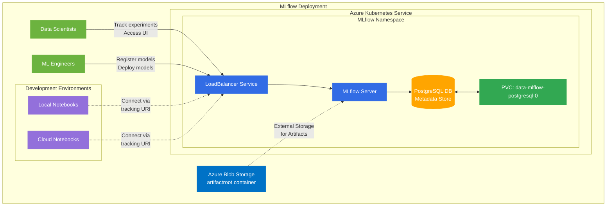

# MLflow Enterprise Platform: Complete Experimentation and Deployment Solution

This repository provides a production-ready, enterprise-grade platform for machine learning experimentation, tracking, and deployment using MLflow. It offers a comprehensive solution that covers the full ML lifecycle from development to production deployment, with robust tooling for hyperparameter optimization, model tracking, and cloud integration.

## Architecture Overview

Our MLflow Enterprise Platform implements a cloud-native architecture with Kubernetes deployment for high availability, scalability, and enterprise integration.



### Key Architecture Components

1. **MLflow Server**: Centralized tracking server deployed on Kubernetes, providing experiment tracking, model registry, and model serving capabilities.

2. **PostgreSQL Database**: Persistent metadata store for all MLflow experiments, runs, and model registry data.

3. **Azure Blob Storage**: Scalable cloud storage for artifacts including models, datasets, and visualizations.

4. **Kubernetes Deployment**: Containerized infrastructure ensuring scalability, reliability and enterprise-grade security.

5. **Client Access Layer**: Unified access points for data scientists and ML engineers across various development environments.

## Enterprise-Grade Features

- **Scalable Architecture**: Deployment on Kubernetes with persistent storage
- **Production Workflows**: Standardized pipelines from training to deployment
- **Security Integration**: Authentication and role-based access control
- **Cloud-Native Infrastructure**: Seamless integration with Azure services
- **Comprehensive Observability**: Advanced tracking and monitoring of all experiments
- **Reproducible Research**: Environment versioning and experiment records
- **Collaborative Development**: Team-oriented ML experiment management

## ML Lifecycle Management

The platform supports the complete machine learning lifecycle:

1. **Data Processing**: Modular preprocessing pipelines with scikit-learn integration
2. **Experimentation**: Structured tracking of parameters, metrics, and artifacts
3. **Hyperparameter Tuning**: Scalable grid and random search with parallel execution
4. **Model Registry**: Version control and stage transitions for models
5. **Deployment**: Seamless transition from experimentation to production
6. **Monitoring**: Runtime tracking of model performance and drift

## Repository Structure

- `data/`: Contains datasets and metadata files
  - `california_housing.csv`: Housing dataset for regression examples
  - `metadata/`: JSON files with dataset schema information
  - `train_test_data.pkl`: Preprocessed train/test data

- `kubernetes/`: Production deployment on Kubernetes
  - `mlflow-values.yaml`: Helm chart values for MLflow server
  - `azure-resource-provisioning.sh`: Scripts for setting up Azure resources

- `model_training/`: Core ML training and tuning code
  - `data_processor.py`: Data loading and preprocessing pipeline
  - `model_trainer.py`: Model training with MLflow tracking
  - `model_tuner.py`: Hyperparameter tuning infrastructure
  - `train.py`: Main training script
  - `tune.py`: Main hyperparameter tuning script
  - `hyperparameter_configs/`: YAML/JSON configurations for tuning different models

- `notebook/`: Jupyter notebooks for interactive examples
  - `adult-classification.ipynb`: Classification example with Adult Income dataset
  - `california_housing-regression.ipynb`: Regression example with housing data

## Installation

1. Clone the repository:
   ```bash
   git clone https://github.com/tharindu-sankalpa/mlflow-enterprise-platform.git
   cd mlflow-enterprise-platform
   ```

2. Install dependencies with Poetry:
   ```bash
   poetry install
   ```
   
   Or with pip:
   ```bash
   pip install -r model_training/requirements.txt
   ```

## Getting Started

### Local MLflow Tracking

1. Start a local MLflow server:
   ```bash
   mlflow ui
   ```

2. Run a basic training job:
   ```bash
   python model_training/train.py
   ```

3. Try hyperparameter tuning:
   ```bash
   python model_training/tune.py --config model_training/hyperparameter_configs/logistic_regression.json
   ```

### Enterprise Deployment on Azure Kubernetes Service

For a production-grade MLflow server deployment:

1. **Provision Azure Resources**:
   ```bash
   bash kubernetes/azure-resource-provisioning.sh
   ```

2. **Deploy MLflow on AKS**:
   ```bash
   helm install mlflow community-charts/mlflow \
     --namespace mlflow \
     --create-namespace \
     -f kubernetes/mlflow-values.yaml
   ```

3. **Configure Environment for Client Access**:
   ```bash
   export MLFLOW_TRACKING_USERNAME="admin"
   export MLFLOW_TRACKING_PASSWORD="<YOUR_PASSWORD>"
   export MLFLOW_TRACKING_URI="http://<EXTERNAL-IP>"
   ```

## Using the Platform

### MLflow Integration in Code

```python
import mlflow

# Connect to tracking server
mlflow.set_tracking_uri("http://<EXTERNAL-IP>")

# Start an experiment run
with mlflow.start_run():
    # Log parameters
    mlflow.log_param("param1", value1)
    
    # Log metrics
    mlflow.log_metric("accuracy", accuracy)
    
    # Log models with full preprocessing pipeline
    mlflow.sklearn.log_model(
        pipeline,
        "model",
        signature=mlflow.models.infer_signature(X_train, y_train),
        input_example=X_train.iloc[:5]
    )
```

### Hyperparameter Tuning

Our platform includes a robust hyperparameter tuning framework that integrates deeply with MLflow:

```bash
# Run grid search with real-time logging
python model_training/tune.py --config model_training/hyperparameter_configs/logistic_regression.json

# Run parallel random search
python model_training/tune.py \
    --config model_training/hyperparameter_configs/xgboost.yaml \
    --search_type random \
    --n_iter 20 \
    --no_real_time_logging
```

### Cloud Execution

For large-scale experiments, submit jobs to Azure ML:

```bash
python model_training/submit_tune_job.py \
  --subscription_id "<your-subscription-id>" \
  --resource_group "<your-resource-group>" \
  --workspace_name "<your-workspace-name>" \
  --compute_target "<your-compute-target>" \
  --config model_training/hyperparameter_configs/random_forest.yaml
```

## Documentation

For detailed documentation on specific components:

- [Model Training System](./model_training/README.md) - Core training pipeline and MLflow integration
- [Hyperparameter Tuning Framework](./model_training/README_HYPERPARAMETER_TUNING.md) - Advanced tuning capabilities
- [Enterprise Deployment on Kubernetes](./kubernetes/README.md) - Production infrastructure setup

## Enterprise Integration Points

- **CI/CD Systems**: Hooks for integrating with Azure DevOps, GitHub Actions, etc.
- **Container Platforms**: Kubernetes deployment for scalable, cloud-agnostic operation
- **Data Storage Systems**: Configurable backends for artifacts and metadata
- **Authentication Services**: Integration with Azure AD and other identity providers
- **Monitoring Tools**: Exportable metrics for integration with enterprise monitoring systems

## Contributing

Contributions are welcome! Please feel free to submit a Pull Request.

## License

This project is licensed under the MIT License - see the LICENSE file for details.

## Acknowledgments

- The UCI Adult Income Dataset
- The MLflow team for their excellent tool
- All contributors to the Python data science ecosystem