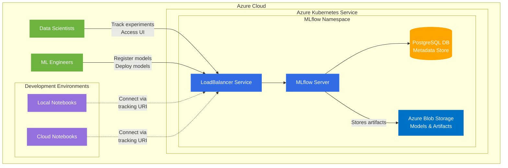

# MLflow on Azure Kubernetes Service (AKS)

This project contains the necessary configuration to deploy MLflow on Azure Kubernetes Service with Azure Blob Storage for artifact storage and PostgreSQL for backend storage.

## Architecture

The architecture consists of the following components:



## Components

1. **Azure Kubernetes Service (AKS)**
   - A managed Kubernetes service for running containerized applications
   - 1 node cluster in Central India region

2. **MLflow Server**
   - Deployed as a Kubernetes deployment
   - Image: burakince/mlflow:2.22.0
   - Protected with basic authentication

3. **PostgreSQL Database**
   - Deployed as a StatefulSet within the Kubernetes cluster
   - Provides persistent backend storage for MLflow metadata
   - Stores experiment details, parameters, metrics, etc.

4. **Azure Blob Storage**
   - Storage account: tharindumlflow0aa3981a
   - Container: artifactroot
   - Stores MLflow artifacts (models, plots, datasets)

5. **Kubernetes Resources**
   - Namespace: mlflow
   - Services: LoadBalancer to expose MLflow UI
   - Persistent Volume Claims: For PostgreSQL storage
   - Secrets: For database credentials, auth configuration

## Setup Instructions

1. Provision Azure resources using the `azure-resource-provisioning.sh` script
2. Configure `mlflow-values.yaml` with appropriate values
3. Deploy MLflow to AKS using Helm

```bash
helm install mlflow community-charts/mlflow \
  --namespace mlflow \
  --create-namespace \
  -f mlflow-values.yaml
```

## Access MLflow UI

The MLflow UI is exposed through a LoadBalancer service with the following credentials:
- Username: admin
- Password: [See mlflow-values.yaml]
- URL: http://<EXTERNAL-IP>

## Environment Variables for MLflow Client

Configure these environment variables to connect to the MLflow tracking server from any environment:

```bash
export MLFLOW_TRACKING_USERNAME="admin"
export MLFLOW_TRACKING_PASSWORD="<YOUR_MLFLOW_UI_ADMIN_PASSWORD>"
export MLFLOW_TRACKING_URI="http://<EXTERNAL-IP>"
```

## Using MLflow in Your Code

Connect to the centralized tracking server from any environment:

```python
import mlflow

# Set the tracking URI to point to the centralized MLflow server
mlflow.set_tracking_uri("http://<EXTERNAL-IP>")

# Start an experiment run
with mlflow.start_run():
    # Log parameters
    mlflow.log_param("param1", value1)
    
    # Log metrics
    mlflow.log_metric("accuracy", accuracy)
    
    # Log artifacts (plots, datasets, etc.)
    mlflow.log_artifact("path/to/plot.png")
    
    # Log models
    mlflow.sklearn.log_model(model, "model")
```

## Local Development Server

For local development and testing, you can run MLflow server on your local machine:

```bash
mlflow server \
    --backend-store-uri file:///path/to/mlruns \
    --default-artifact-root file:///path/to/mlruns \
    --host 0.0.0.0 \
    --port 5000 \
    --workers 2
```

## Benefits of Centralized MLflow Server

1. **Collaboration**: Teams can easily share experiments and models
2. **Reproducibility**: Track all parameters, metrics, and dependencies for each experiment
3. **Governance**: Maintain a central registry of models and their versions
4. **Deployment**: Streamline the path from experimentation to production
5. **Comparison**: Easily compare performance across multiple experiments and models