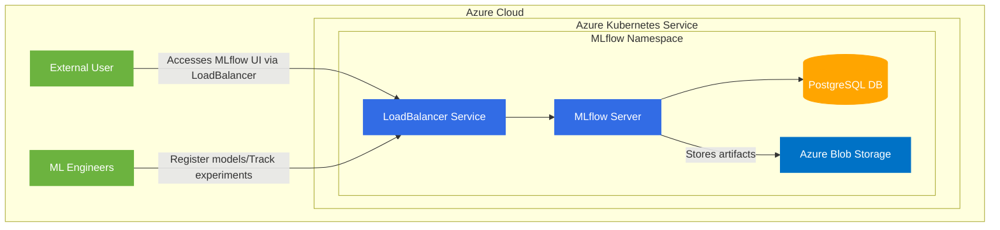

# MLflow on Azure Kubernetes Service (AKS)

This project contains the necessary configuration to deploy MLflow on Azure Kubernetes Service with Azure Blob Storage for artifact storage and PostgreSQL for backend storage.

## Architecture

The architecture consists of the following components:



## Components

1. **Azure Kubernetes Service (AKS)**
   - A managed Kubernetes service for running containerized applications
   - 1 node cluster in Central India region

2. **MLflow Server**
   - Deployed as a Kubernetes deployment
   - Image: burakince/mlflow:2.22.0
   - Protected with basic authentication

3. **PostgreSQL Database**
   - Deployed as a StatefulSet within the Kubernetes cluster
   - Provides persistent backend storage for MLflow metadata
   - Stores experiment details, parameters, metrics, etc.

4. **Azure Blob Storage**
   - Storage account: tharindumlflow0aa3981a
   - Container: artifactroot
   - Stores MLflow artifacts (models, plots, datasets)

5. **Kubernetes Resources**
   - Namespace: mlflow
   - Services: LoadBalancer to expose MLflow UI
   - Persistent Volume Claims: For PostgreSQL storage
   - Secrets: For database credentials, auth configuration

## Setup Instructions

1. Provision Azure resources using the `azure-resource-provisioning.sh` script
2. Configure `mlflow-values.yaml` with appropriate values
3. Deploy MLflow to AKS using Helm

```bash
helm install mlflow community-charts/mlflow \
  --namespace mlflow \
  --create-namespace \
  -f mlflow-values.yaml
```

## Access MLflow UI

The MLflow UI is exposed through a LoadBalancer service with the following credentials:
- Username: admin
- Password: [See mlflow-values.yaml]
- URL: http://<EXTERNAL-IP>

## Environment Variables for MLflow Client

```bash
export MLFLOW_TRACKING_USERNAME="admin"
export MLFLOW_TRACKING_PASSWORD="<YOUR_MLFLOW_UI_ADMIN_PASSWORD>"
export MLFLOW_TRACKING_URI="http://<EXTERNAL-IP>"
```

## Local Development Server

For local development, you can run MLflow server on your local machine:

```bash
mlflow server \
    --backend-store-uri file:///path/to/mlruns \
    --default-artifact-root file:///path/to/mlruns \
    --host 0.0.0.0 \
    --port 5000 \
    --workers 2
```